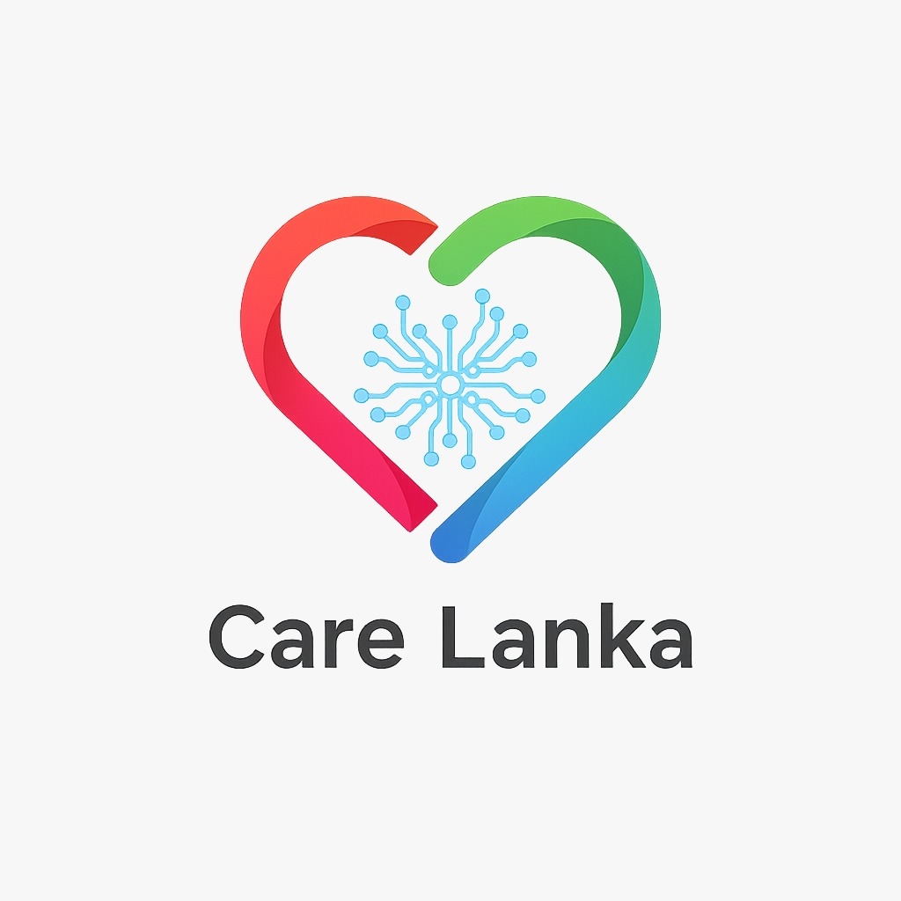

# 🫀 Care Lanka — AI-Driven Cardiovascular Health Monitoring

**An AI-powered mobile health application for cardiovascular disease 
prevention tailored to Sri Lankan dietary and lifestyle contexts.**

[Features](#-features) •
[Architecture](#-system-architecture) •
[Installation](#-installation) •
[API Docs](#-api-documentation) •
[Screenshots](#-screenshots) •
[Project Report](#-project-report)

---

## 📋 Table of Contents

- [Overview](#-overview)
- [Features](#-features)
- [System Architecture](#-system-architecture)
- [Technology Stack](#-technology-stack)
- [Project Structure](#-project-structure)
- [Installation](#-installation)
  - [Backend Setup](#backend-setup-fastapi)
  - [Mobile Setup](#mobile-setup-react-native)
- [API Documentation](#-api-documentation)
- [AI Components](#-ai-components)
  - [YOLOv8 Food Detection](#1-yolov8-food-detection)
  - [OpenCV Oil Classifier](#2-opencv-oil-classifier)
  - [Random Forest Risk Model](#3-random-forest-risk-prediction)
- [Firebase Schema](#-firebase-schema)
- [Screenshots](#-screenshots)
- [Known Limitations](#-known-limitations)
- [Project Report](#-project-report)
- [Author](#-author)

---

## 🌟 Overview

Care Lanka is a final year Computing project (PUSL3190) developed at 
Plymouth University Sri Lanka (NSBM Green University). It addresses the 
critical gap in cardiovascular health monitoring tools for Sri Lankan users 
by combining:

- **Real-time AI food recognition** trained on Sri Lankan dishes
- **Novel OpenCV oil classification** without external API dependency  
- **Clinical heart disease risk prediction** using Random Forest
- **Geolocation-based health alerts** near unhealthy food outlets
- **Android Health Connect integration** for passive activity tracking

> ⚠️ **Disclaimer:** Care Lanka is an academic research prototype.  
> It is not a certified medical device and should not replace 
> professional medical advice.

---

## ✨ Features

### 🍽️ AI Food Recognition
- YOLOv8 model custom trained on 30+ Sri Lankan dish classes
- Real-time detection from camera or gallery image
- Portion estimation using bounding box area ratios
- Calorie and macronutrient calculation from Sri Lanka nutrition database
- Handles multicurry plate detection (multiple foods simultaneously)

### 🫙 Oil Level Classification *(Novel Contribution)*
- OpenCV computer vision pipeline — no external API required
- Four visual signals: specular highlights, colour saturation, 
  warm colour ratio, glossiness score
- Hybrid fusion with rule-based Sri Lankan cooking knowledge
- 0.1 second processing vs 3 seconds for GPT-4o
- Zero per-image cost, fully offline capable

### ❤️ Cardiovascular Risk Prediction
- Random Forest classifier trained on UCI Heart Disease dataset
- 9 clinical features collected within the app
- Multi-source data assembly: profile + lab reports + FAQ answers
- Risk levels: Low / Medium / High with probability score
- Results saved to Firestore for longitudinal tracking

### 📍 Geolocation Health Alerts
- Real-time proximity detection using Haversine formula
- Alerts when within 200m of unhealthy food outlets
- Walk suggestions when calorie target exceeded near parks
- 30-minute cooldown prevents alert fatigue
- Based on JITAI (Just-In-Time Adaptive Intervention) framework

### 📱 Activity Tracking
- Android Health Connect integration
- Tracks: steps, active minutes, heart points, sleep, calories burned
- Daily activity saved to Firestore
- Reflected in home dashboard in real time

### 🎯 User Experience
- Animated splash screen with heartbeat pulse effect
- Lottie celebration animations for goal achievements
- Daily streak badge for consistent logging
- Meal type selector: Breakfast / Lunch / Dinner / Snacks
- Pull-to-refresh on all data screens

---

## 🏗️ System Architecture
